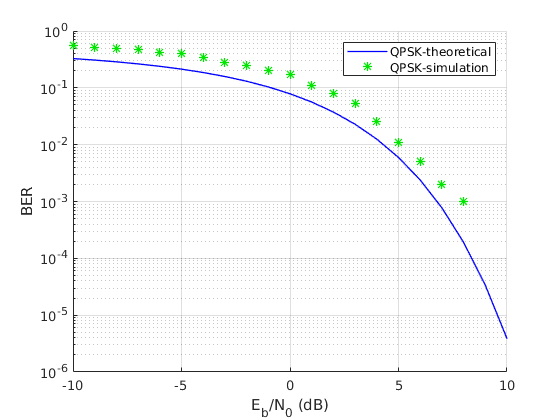
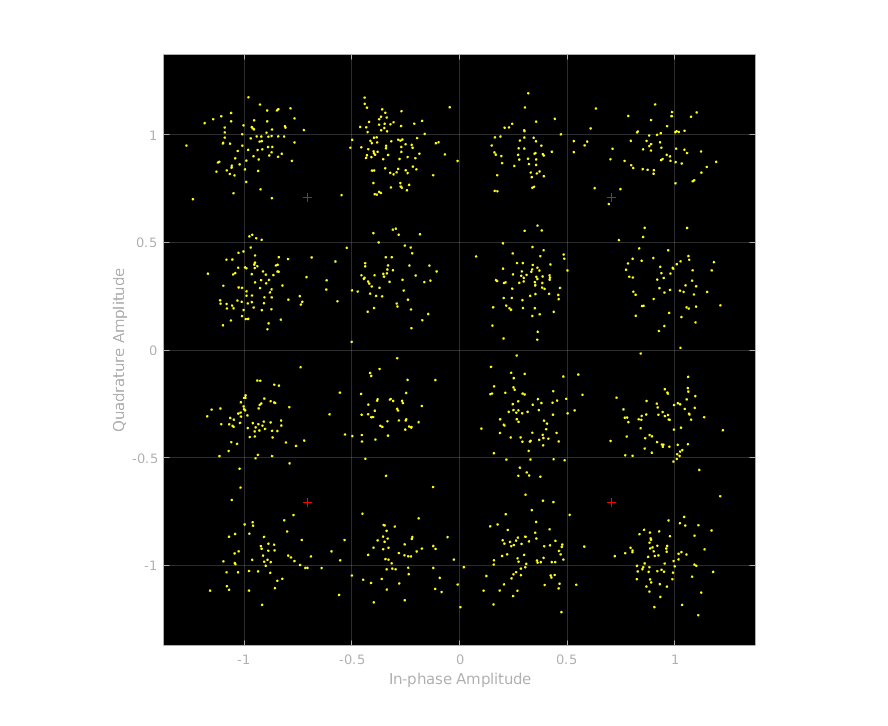
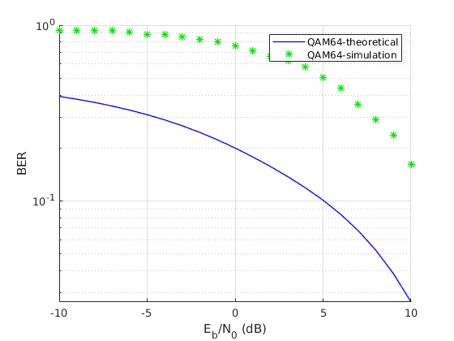

# Digital Communications Project

This repo contains the ELC325 course project of the year 2019 in Cairo University.
 
The following modulation schemes are simulated using Simulink and Matlab:
- **BPSK**
- **QPSK**
- **FSK**
- **QAM16**
- **QAM64**

The BERTool is used to produce the BER diagrams. To reproduce:
- Enter the command 'bertool' in a matlab shell
- Go to the 'Monte Carlo' tab
- Set Eb/No range to -10:10
- Choose the model you want to simulate
- Set BER variable name to 'BER'
- Run

## Binary Phase Shift Keying (BPSK)
### Brief Description
In the PSK modulation scheme information is represented by the phase of the carrier signal,
while the frequency is constant. When the symbols are binary, a phase shift of pi/2 is used,
which maximizes the distance between the two constellation points.

### Schematic

### Scatter Plot at the Transmitter

### Scatter Plot at the Reciever

### BER Diagram

## Quadrature Phase Shift Keying (QPSK)
### Brief Description
This is a PSK schema like BPSK, but the carrier holds two bits of information instead
of one. Hence it uses 4 different phases spaced equally.

### Schematic

### Scatter Plot at the Transmitter

### Scatter Plot at the Reciever

### BER Diagram

## Frequency Shift Keying (FSK)
### Brief Description
In this schema information is represented by the frequency change of the carrier,
while (usually) maintaining the phase. Binary FSK is used here.

### Schematic

### Scatter Plot at the Transmitter

### Scatter Plot at the Reciever

### BER Diagram

## Quadrature Amplitude Modulation (QAM)
### Brief Description
This schema combines both amplitude and phase to represent information. In the
analog case two orthogonal streams (phase difference = pi/2) are transmitted
where each stream is amplitude modulated. In the digital case the amplitudes
are chosen (usually) to form a square grid, where each point represents a different
symbol. A QAM16 symbol can represent a 4-bit number (16 symbol), where as QAM64
symbol can represent a 6-bit number (64 symbol).

## QAM16
### Schematic

### Scatter Plot at the Transmitter

### Scatter Plot at the Reciever

### BER Diagram

## QAM64
### Schematic

### Scatter Plot at the Transmitter

### Scatter Plot at the Reciever

### BER Diagram

